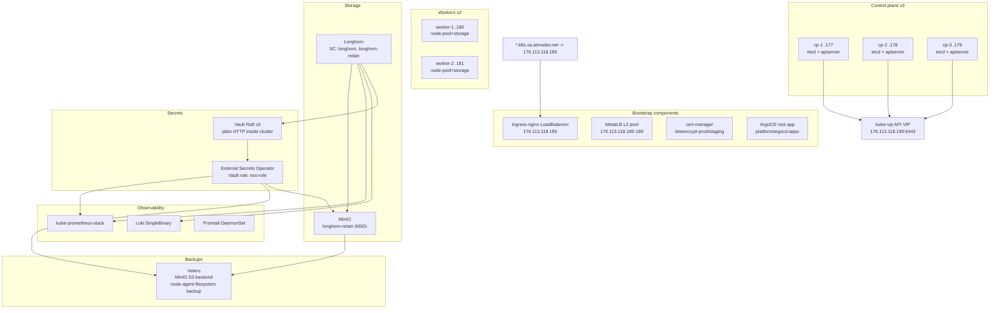

# Актуальное состояние кластера

> Обновлено: 2026-05-10. Kubernetes 1.34.3 · Calico VXLAN · IPVS kube-proxy · Longhorn block storage.

## Архитектура

## GitOps ordering

Root app watches `platform/argocd-apps/` as a flat directory. Child Applications use sync-wave annotations:

| Wave | App |
|---:|---|
| -20 | `platform` AppProject |
| -15 | namespaces |
| -14 | NetworkPolicies |
| -12 | Longhorn |
| -10 | Vault |
| -9 | External Secrets Operator |
| -8 | MinIO |
| -6 | Registry pull secrets |
| 0 | kube-prometheus-stack |
| 5 | Loki |
| 6 | Promtail |
| 10 | Velero |
| 20 | Longhorn monitoring |

## Security posture

- Kubernetes Dashboard is not exposed through Ingress and does not create a long-lived cluster-admin token.
- Longhorn UI Ingress is disabled; use port-forward or add protected OIDC/VPN ingress.
- App namespaces `va-dev`, `va-stage`, `va-prod` have Pod Security labels, ResourceQuota, LimitRange, and default-deny NetworkPolicies.
- Secrets flow: `credentials.env` -> `make vault-bootstrap` -> Vault KV -> ESO -> Kubernetes Secrets.

## Known operational risks

- MinIO is currently inside the same cluster as Velero. For full cluster disaster recovery, replicate MinIO data off-cluster or move Velero to external S3.
- `make apply-minio` remains as a first-install workaround for the MinIO chart hook behavior; bucket creation itself is managed by the ArgoCD PostSync hook.
- Worker root disks are small. Keep `/var/lib/containerd` and `/var/lib/longhorn` on the secondary disk and watch root filesystem pressure.
