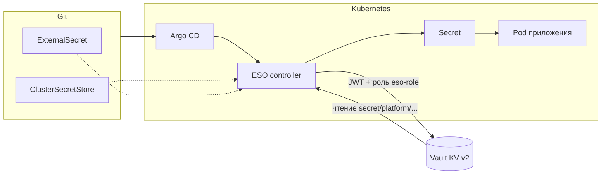

## External Secrets Operator (ESO)

### Зачем нужен

ESO синхронизирует секреты из внешнего хранилища (в нашем случае **HashiCorp Vault**) в обычные Kubernetes `Secret`. Приложения по-прежнему читают **только** Kubernetes API (`envFrom`, `secretKeyRef`, volumes) — им не нужен клиент Vault.

Это даёт:
- единое место правды для секретов в **Vault**;
- доставку значений в нужные namespace’ы **через Git** (манифесты `ExternalSecret`);
- отсутствие root token и долгоживущих статических токенов в манифестах приложений;
- периодическое обновление целевого `Secret` по `refreshInterval` (если секрет в Vault изменился).

### Как это работает (сквозной поток)

1. В Git лежат манифесты: `ClusterSecretStore` (как подключаться к Vault) и `ExternalSecret` (что именно забрать и во что положить).
2. **Argo CD** применяет их в кластер.
3. Контроллер ESO (namespace `external-secrets`) читает `ExternalSecret`, берёт для Vault **краткоживущий JWT** сервисного аккаунта `secrets-external-secrets` и логинится в Vault через **`auth/kubernetes`** и роль **`eso-role`**.
4. Vault проверяет JWT через Kubernetes API (для этого у подов Vault выдан `ClusterRoleBinding` на `system:auth-delegator`, см. `platform/argocd-apps/secrets/vault/kubernetes-auth-delegator.yaml`).
5. После логина к Vault применяется политика **`eso-policy`**: разрешено читать только ветку **`secret/data/platform/*`** (и метаданные для list).
6. ESO забирает данные из **KV v2** (`mount` = `secret`, версия `v2`) и создаёт/обновляет целевой **`Secret`** в namespace приложения.

Упрощённая схема:



### Как деплоится

Всё **только через Argo CD** (GitOps):

| Что | Где в репозитории |
|-----|-------------------|
| Оператор ESO (Helm) | `platform/argocd-apps/secrets/external-secrets/application.yaml` |
| Job установки CRD (server-side apply) | `platform/argocd-apps/secrets/external-secrets-crds/job.yaml` (подхватывается `root-app` вместе с остальными манифестами в `platform/argocd-apps`) |
| Общий store для Vault | `platform/argocd-apps/secrets/secret-stores/vault-clustersecretstore.yaml` |
| Argo `Application`, который синкает только store | `platform/argocd-apps/secrets/secret-stores-app/application.yaml` |
| Пример `ExternalSecret` | `platform/argocd-apps/secrets/external-secrets-samples/argocd-example.yaml` |
| Argo `Application` для примеров | `platform/argocd-apps/secrets/external-secrets-samples-app/application.yaml` |

Namespace оператора: **`external-secrets`**. Chart: **`external-secrets/external-secrets`**, версия **2.4.1**.

### Как настроена интеграция с Vault

- **KV v2** смонтирован на путь **`secret/`** (если кластер новый — однократно: `vault secrets enable -path=secret kv-v2`, см. `docs/vault.md`).
- **Kubernetes auth** на **`auth/kubernetes`**, роль **`eso-role`** привязана к SA **`secrets-external-secrets`** в **`external-secrets`**.
- **`ClusterSecretStore` `vault`**: сервер `http://secrets-vault-active.vault.svc:8200`, `path: secret`, `version: v2`, `mountPath` для логина: `kubernetes`.

Операционная первоначальная настройка Vault (политика, роль, включение движков) описана в **`docs/vault.md`** — в Git кладём только RBAC для TokenReview и манифесты ESO/store/`ExternalSecret`.

### Соглашения по путям в Vault (KV v2)

Рекомендуемый префикс для платформенных секретов:

- логический путь секрета: **`secret/platform/<имя>`** (в CLI: `vault kv put secret/platform/<имя> key=value`);
- для ESO в `remoteRef.key` указывают **путь относительно mount без префикса `data/`**: например **`platform/grafana`** для данных в `secret/data/platform/grafana`.

Роль **`eso-role`** сейчас ориентирована на **`secret/.../platform/...`**. Если приложению нужен другой префикс — расширяют политику в Vault и согласуют нейминг (это уже операционное изменение, не только Git).

### Как пользоваться при добавлении нового приложения

#### 1) Положить секрет в Vault

Из пода Vault (с админ-токеном) или через UI:

```bash
vault kv put secret/platform/<сервис> \
  password='…' \
  api_token='…'
```

Ключи (`password`, `api_token`) станут полями JSON в KV; из них можно собрать Kubernetes `Secret` по одному или нескольким полям.

#### 2) Добавить `ExternalSecret` в Git

- Манифест кладите рядом с приложением (например `platform/argocd-apps/<каталог-приложения>/externalsecret.yaml`) **или** в отдельном `Application`, которое указывает на каталог с манифестами — главное, чтобы Argo CD этот путь синхронизировал.
- **`namespace`**: тот же, где будут Deployment и целевой `Secret`.
- **`secretStoreRef`**: для общего сценария — `name: vault`, `kind: ClusterSecretStore` (как в примере ниже).
- **`target.name`**: имя создаваемого Kubernetes `Secret` (часто совпадает с именем `ExternalSecret` или с именем, ожидаемым Helm chart).
- **`data`**: список соответствий `secretKey` (ключ в Kubernetes `Secret`) → `remoteRef.key` (путь в Vault относительно mount `secret`) + `property` (имя поля в KV).

Минимальный шаблон:

```yaml
apiVersion: external-secrets.io/v1
kind: ExternalSecret
metadata:
  name: <имя>
  namespace: <namespace-приложения>
spec:
  refreshInterval: 1h
  secretStoreRef:
    name: vault
    kind: ClusterSecretStore
  target:
    name: <имя-kubernetes-secret>
    creationPolicy: Owner
  data:
    - secretKey: <ключ-в-k8s-secret>
      remoteRef:
        key: platform/<сервис>
        property: <поле-в-vault-kv>
```

Рабочий пример в репозитории: `platform/argocd-apps/secrets/external-secrets-samples/argocd-example.yaml` (namespace `argocd`, путь `platform/example`, поле `demo`).

**Забрать все пары ключ–значение** из одного пути KV можно через `dataFrom` (удобно, когда набор полей часто меняется):

```yaml
spec:
  dataFrom:
    - extract:
        key: platform/<сервис>
```

Тогда ключи в Kubernetes `Secret` совпадут с ключами в Vault для этого пути.

#### 3) Подключить `Secret` к Pod

Обычные паттерны Kubernetes:

- **`env`** / **`envFrom`** с `secretKeyRef` / `secretRef`;
- **volume** типа `secret` для файлов конфигурации.

ESO только поддерживает целевой `Secret` в актуальном состоянии; дальше приложение потребляет его как любой другой секрет.

#### 4) Проверить в кластере

```bash
kubectl get clustersecretstore vault
kubectl -n <ns> get externalsecret <имя>
kubectl -n <ns> get secret <имя-kubernetes-secret> -o yaml
```

Статус `ExternalSecret`: условие **`Ready=True`**, в `status.binding.name` — имя созданного `Secret`.

### ClusterSecretStore и namespace

**`ClusterSecretStore`** — кластерный ресурс: один раз описали `vault`, ссылаться можно из **любого** namespace. Это наш основной вариант для платформенных секретов.

**`SecretStore`** (namespace-scoped) имеет смысл, если позже понадобятся **разные Vault-роли** или изоляция по окружениям на уровне namespace; тогда store и SA обычно живут в том же namespace, что и приложение.

### Предусловия и типичные сбои

- **Vault распечатан** и доступен сервису `secrets-vault-active.vault.svc:8200`.
- **`ClusterSecretStore vault`** в статусе **Ready**.
- JWT / роль: если после ротации или переустановки ESO изменилось имя SA — нужно синхронизировать **`bound_service_account_names`** в роли Vault и **`serviceAccountRef`** в `ClusterSecretStore` (сейчас: **`secrets-external-secrets`**).
- **403 / permission denied** в логах ESO: проверить политику `eso-policy` и путь секрета (не вылезает ли за `platform/*`).
- Секрет в Vault есть, а в Kubernetes пусто: проверить **`remoteRef.key`** и **`property`** (опечатка в пути или имени поля).

### Troubleshooting (команды)

```bash
kubectl -n external-secrets get pods
kubectl -n external-secrets logs deploy/secrets-external-secrets --tail=200
kubectl get clustersecretstore vault -o yaml
kubectl -n <ns> describe externalsecret <имя>
```

Подробнее про включение **`auth/kubernetes`**, политику **`eso-policy`** и роль **`eso-role`**: **`docs/vault.md`**.
